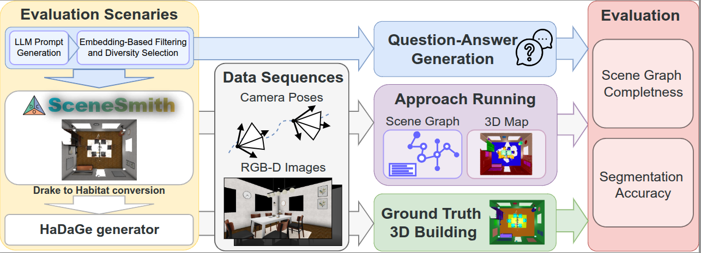

> Project page, paper, and dataset links will be added after release.

# OSMa-Bench++

OSMa-Bench++ is a prompt-grounded extension pipeline for evaluating open-vocabulary semantic mapping methods on generated indoor scenes. It connects [SceneSmith](https://github.com/nepfaff/scenesmith), [Habitat / Habitat-Lab](https://github.com/facebookresearch/habitat-lab), [HaDaGe](https://github.com/warmhammer/habitat_data_generator), and the original [OSMa-Bench](https://github.com/be2rlab/OSMa-Bench) VQA code.

The goal is to evaluate whether open-vocabulary semantic maps preserve information that is useful for manipulation-oriented reasoning. Standard VQA pipelines usually generate questions from visual descriptions or rendered images. OSMa-Bench++ adds a complementary PromptGT branch: questions are generated from the original SceneSmith prompts, so the expected answers are grounded in the scene specification used to create the environment.

<p align="center">
  
</p>

OSMa-Bench++ keeps upstream repositories unchanged where possible. External repositories are cloned under `data/external/`, while this repository stores only adapters, patches, scripts, and generated-data layout conventions.

## Main pipeline

The pipeline has four stages.

### 1. Prompt and scene generation

- Generate controlled SceneSmith prompts for furniture and manipuland scenes.
- Run SceneSmith to generate synthetic indoor scenes.
- Extract prompt metadata from generated SceneSmith scene folders.

### 2. Export and Habitat packaging

- Export SceneSmith scenes to MuJoCo and USD.
- Fix OBJ/MTL texture bindings.
- Convert SceneSmith exports into Habitat SceneDataset-style configs.
- Pack many generated scenes into one Habitat-compatible dataset.

### 3. HaDaGe sequence generation

- Generate HaDaGe simulation settings for each packed scene.
- Render RGB-D and semantic observations under several lighting conditions.
- Store generated sequences for semantic mapping and VQA evaluation.

### 4. PromptGT and OSMa-Bench VQA

- Generate PromptGT question-answer files from original SceneSmith prompts.
- Write PromptGT questions directly into the OSMa-Bench VQA layout.
- Run original OSMa-Bench scene-graph answering directly.
- Skip the OSMa-Bench validation stage for PromptGT.
- Aggregate Standard VQA and PromptGT results.

## External repositories

External repositories must be cloned under `data/external/`.

```text
data/external/
  scenesmith/
  habitat_data_generator/
  OSMa-Bench/
```

Required upstream repositories:

- [SceneSmith](https://github.com/nepfaff/scenesmith)
- [HaDaGe / habitat_data_generator](https://github.com/warmhammer/habitat_data_generator)
- [OSMa-Bench](https://github.com/be2rlab/OSMa-Bench)
- [Habitat-Lab](https://github.com/facebookresearch/habitat-lab)

Clone external repositories:

```bash
./scripts/00_setup_external_repos.sh
```

Apply the local HaDaGe patch:

```bash
./scripts/01_apply_hadage_patch.sh
```

## Installation

Two environments are used:

```text
osma-bench-pp              # main environment: OSMa-Bench++, SceneSmith, Habitat, HaDaGe, OSMa-Bench VQA
scenesmith_mujoco_export   # export-only environment: MuJoCo + USD export
```

The separate MuJoCo export environment is used because MuJoCo/USD dependencies can conflict with other parts of the stack.

### Main environment

Create and activate the main environment:

```bash
conda create -n osma-bench-pp python=3.9 -y
conda activate osma-bench-pp
conda install -y pip
```

Install Habitat-Sim:

```bash
conda install -y -c conda-forge -c aihabitat habitat-sim=0.3.3 withbullet headless
```

Install Python dependencies:

```bash
python -m pip install -U pip
python -m pip install pillow==10.4.0 numpy==1.26.4 scipy pyyaml trimesh openai pandas matplotlib
python -m pip install "git+https://github.com/facebookresearch/habitat-lab.git@v0.3.3#subdirectory=habitat-lab"
```

Install patched HaDaGe:

```bash
cd data/external/habitat_data_generator
python -m pip install -e .
cd ../../..
```

Set local Python path:

```bash
export PYTHONPATH="$PWD/src:$PYTHONPATH"
```

### MuJoCo/USD export environment

Create and activate the export environment:

```bash
conda create -n scenesmith_mujoco_export python=3.10 -y
conda activate scenesmith_mujoco_export
conda install -y pip
```

Install export dependencies:

```bash
python -m pip install -U pip setuptools wheel
python -m pip install \
  "mujoco>=3.8.0" \
  trimesh \
  pyyaml \
  pillow \
  numpy \
  scipy \
  usd-core \
  mujoco-usd-converter \
  drake \
  omegaconf
```

## Prompt generation

OSMa-Bench++ contains prompt generation utilities for two regimes:

- `furniture`: furniture-only room-scale layouts.
- `manipuland`: furniture layouts with controlled manipulable objects.

Set the OpenAI key:

```bash
export OPENAI_API_KEY="..."
```

Generate furniture prompts:

```bash
python -m osmabench_pp.prompts.generate \
  --scene-type furniture \
  --raw-target 300 \
  --final-target 20 \
  --output-dir outputs/prompts/furniture
```

Generate manipuland prompts:

```bash
python -m osmabench_pp.prompts.generate \
  --scene-type manipuland \
  --raw-target 100 \
  --final-target 15 \
  --output-dir outputs/prompts/manipuland
```

`final_prompts.csv` is used as input for SceneSmith generation.

## SceneSmith scene generation

SceneSmith generation is launched through the OSMa-Bench++ runner, which is used to run already selected prompt CSV files through the upstream SceneSmith repository. It does not modify SceneSmith. For each prompt, it creates a temporary one-row CSV, launches SceneSmith `main.py`, streams logs, detects the success marker, stops the SceneSmith process group, and writes a per-scene log plus a JSON summary.

The CSV format is:

```text
scene_index,prompt
1,"A dining room with 1 dining table..."
2,"A living room with 2 sofas..."
```

Run furniture prompts:

```bash
python -m osmabench_pp.scenesmith.run_prompts \
  --csv outputs/prompts/furniture/final_prompts.csv \
  --scenesmith-root data/external/scenesmith \
  --main data/external/scenesmith/main.py \
  --logs-dir runner_logs/scenesmith_furniture \
  --summary-json runner_logs/scenesmith_furniture/summary.json \
  --start-index 1 \
  --end-index 20 \
  --continue-on-error \
  -- <SCENESMITH_HYDRA_OVERRIDES>
```

Run manipuland prompts:

```bash
python -m osmabench_pp.scenesmith.run_prompts \
  --csv outputs/prompts/manipuland/final_prompts.csv \
  --scenesmith-root data/external/scenesmith \
  --main data/external/scenesmith/main.py \
  --logs-dir runner_logs/scenesmith_manipuland \
  --summary-json runner_logs/scenesmith_manipuland/summary.json \
  --start-index 1 \
  --end-index 15 \
  --continue-on-error \
  -- <SCENESMITH_HYDRA_OVERRIDES>
```

Everything after `--` is passed directly to SceneSmith as Hydra overrides. Use this part to set SceneSmith-specific options, including the output directory for generated scenes.

## Export SceneSmith scenes to MuJoCo/USD

Activate the export environment:

```bash
conda activate scenesmith_mujoco_export
export PYTHONPATH="$PWD/src:$PWD/data/external/scenesmith:$PYTHONPATH"
```

Export one scene:

```bash
./scripts/02_export_one_scene_mujoco.sh \
  data/scenes/scenesmith_raw/furniture_stage/scene_001
```

Enable textures fix:

```bash
./scripts/03_fix_textures_one_scene.sh \
  data/scenes/scenesmith_raw/furniture_stage/scene_001
```


## Convert one SceneSmith scene to Habitat configs

```bash
python -m osmabench_pp.habitat.scenesmith_to_habitat \
  --scene-root data/scenes/scenesmith_raw/furniture_stage/scene_001 \
  --out-root /tmp/scenesmith_habitat_scene_001
```

Render a preview:

```bash
python -m osmabench_pp.habitat.render_preview \
  --dataset-config /tmp/scenesmith_habitat_scene_001/scene_001.scene_dataset_config.json \
  --scene-id /tmp/scenesmith_habitat_scene_001/scenes/scene_001.scene_instance.json \
  --output /tmp/scenesmith_habitat_scene_001/preview.png \
  --width 1280 \
  --height 720 \
  --height-scale 1.4 \
  --distance-scale 2.2 \
  --target-height-scale 0.45
```

## Pack many SceneSmith scenes into one Habitat dataset

```bash
./scripts/04_pack_scenesmith_dataset.sh
```

Render preview from the packed dataset:

```bash
./scripts/05_render_preview_one_scene.sh furniture_stage__scene_001
```

## Run HaDaGe

Run all generated HaDaGe configs:

```bash

./scripts/06_run_hadage_all.sh
```

## Collect SceneSmith prompt metadata

Extract original SceneSmith prompts from generated scene folders:

```bash
./scripts/07_collect_scenesmith_metadata.sh
```

Expected CSV columns:

```text
subset,scene_name,scene_path,prompt_source,house_prompt,room_prompts,room_text_descriptions
```

## Generate PromptGT questions

PromptGT QA is generated from the original SceneSmith prompt metadata, not from images. The output is compatible with the OSMa-Bench QA JSON format.

Set the OpenAI key:

```bash
export OPENAI_API_KEY="..."
```

Generate questions:

```bash
./scripts/08_generate_promptgt_qa.sh
```

Example JSON:

```json
{
  "scene_name": "furniture_stage__scene_001",
  "parameters": [
    {
      "frame": "prompt_ground_truth",
      "qa": [
        {
          "question": "How many office chairs are around the conference table?",
          "answer": "8",
          "category": "PromptGT-Measurement"
        }
      ]
    }
  ]
}
```

## Run original OSMa-Bench answering

PromptGT skips the OSMa-Bench validation stage. The generated questions are passed directly to the original scene graph answering module.

Required inputs:

```text
1. PromptGT questions:
   data/osma_vqa_workdir/<scene>/vqa/<scene>_questions.json

2. Scene graph produced by a mapping method:
   e.g. BBQ or ConceptGraphs JSON for the same scene and lighting condition

3. OSMa-Bench VQA config:
   data/external/OSMa-Bench/vqa/config/gemini_qa.yml
```

Run one scene:

```bash
./scripts/09_run_promptgt_answering_one.sh \
  furniture_stage__scene_001 \
  /path/to/scene_graph.json \
  BBQ \
  baseline
```

Expected output:

```text
outputs/vqa_promptgt/BBQ/evaluated_baseline/furniture_stage__scene_001_answered.json
```

## Aggregate Standard VQA and PromptGT results

```bash
./scripts/10_aggregate_promptgt_metrics.sh /path/to/standard/VQA_EVAL
```


## Current limitations

- The exact graph paths for BBQ and ConceptGraphs must be supplied from the mapping pipeline output.
- PromptGT validation is intentionally skipped.
- HaDaGe SceneSmith support is maintained as a patch against upstream `habitat_data_generator`.

## Citation

A citation entry will be added after the paper is publicly available.

If you use this repository before the paper release, please cite the repository URL.

## License

This project is released under the Creative Commons Attribution 4.0 International License.

External repositories used by this pipeline retain their original licenses.
